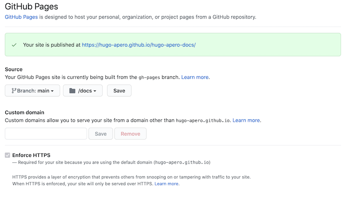

# Publishing

As you develop the book, you make the draft book available to the public to get early feedback from readers, e.g., publish it to a website. After you finish writing the book, you need to think about options to formally publish it as either printed copies or e-books.

## RStudio Connect

In theory, you can render the book by yourself and publish the output anywhere you want. For example, you can host the HTML files on your own web server. We have provided a function `publish_book()` in **bookdown** to make it very simple to upload your book to https://bookdown.org, which is a website provided by RStudio to host your books for free.\index{bookdown.org} This website is built on top of ["RStudio Connect",](https://www.rstudio.com/products/connect/)\index{RStudio Connect} an RStudio product that allows you to deploy a variety of R-related applications to a server, including R Markdown documents, Shiny applications, R plots, and so on.

You do not have to know much about RStudio Connect to publish your book to bookdown.org. Basically you sign up at https://bookdown.org/connect/, and the first time you try to run `bookdown::publish_book()`\index{bookdown::publish\_book()}, you will be asked to authorize **bookdown** to publish to your bookdown.org account. In the future, you simply call `publish_book()` again and **bookdown** will no longer ask for anything.

```{r publish-book-usage, eval=FALSE, code=formatR::usage(bookdown::publish_book, output=FALSE)}
```

The only argument of `publish_book()` that you may want to touch is `render`. It determines whether you want to render the book before publishing. If you have run `render_book()` before, you do not need to change this argument, otherwise you may set it to `'local'`:

```{r eval=FALSE}
bookdown::publish_book(render = 'local')
````

If you have set up your own RStudio Connect server, you can certainly publish the book to that server instead of bookdown.org.

## GitHub Pages {#github}

You can host your book on GitHub\index{GitHub} for free via GitHub Pages (<https://pages.github.com>).^[See the [GitHub Pages Help documents](http://bit.ly/2cvloKV) for more information.] The simplest approach is to publish your book as a [GitHub Project Page](https://help.github.com/en/articles/user-organization-and-project-pages#project-pages-sites) from a `/docs` folder on your `main` branch, which will then be available at `https://<USER>.github.io/<REPO>` (unless you provide a custom domain name). The main benefit to this approach is its simplicity, and the fact that you can track the source files for your book and the published HTML files in the same branch.

### The build-and-deploy pipeline sequence

This publishing approach sets up the following flow of events:

1. You create a local **bookdown** project in a GIT repository that is connected to a GitHub repository. The below steps assume you are on your `main` branch.
1. You change the output directory of your rendered book to a folder named `"docs"`.
1. You tell GitHub Pages to bypass using Jekyll to build your site.
1. You build your book locally, then push to send your local changes online to GitHub.
1. The push to the `main` branch triggers GitHub Pages to publish your book at: `https://<USER>.github.io/<REPO>`.
1. Rinse and repeat! Every push to `main` triggers the online version of your book to update.

The above is an overview- read on for step-by-step instructions.

### Before you begin

1. You need a GitHub (<https://github.com/>) account.^[If you are not familiar with GitHub, we suggest you read through the free online book "Happy Git with R" (<https://happygitwithr.com/>) first before working through these instructions.]

1. Start with a **bookdown** project linked to a remote GitHub repository that you can push/pull to from your local copy. 
    
:::{.rmdimportant latex=true}

If you don't have an existing book, you can create a simple **bookdown** HTML book to practice with instead:

+ Make a new repository on GitHub (<https://happygitwithr.com/new-github-first.html#make-a-repo-on-github-2>),
+ Make a new RStudio Project via git clone: (<https://happygitwithr.com/new-github-first.html#new-rstudio-project-via-git-clone>),
+ From your RStudio Project, run this command in your R console: `bookdown::create_gitbook()` or `bookdown::create_bs4_book()` (depending on the HTML output format you want),
+ Change anything you want (or change nothing) and commit (<https://happygitwithr.com/new-github-first.html#make-local-changes-save-commit-1>),
+ Push your local changes to GitHub (<https://happygitwithr.com/new-github-first.html#push-your-local-changes-to-github>).

:::


### Change the output directory of your book

In your local **bookdown** project, open the `_bookdown.yml` file and change the output directory of your book to be `/docs` by adding this line:

```yaml
output_dir: "docs"
```

Save this file and close it.

### Tell GitHub Pages to bypass Jekyll

Create a hidden, empty file named `.nojekyll` from within R in your **bookdown** project root directory:

```
file.create(".nojekyll")
```

If you are using RStudio, you may need to refresh the viewer pane to see this new file. You can also use the terminal to create this file with the command `touch .nojekyll`.

This file is [necessary](https://github.blog/2009-12-29-bypassing-jekyll-on-github-pages/) because GitHub Pages supports Jekyll ([jekyllrb.com](http://jekyllrb.com)), a static website builder, by default. You need the `.nojekyll` file because bookdown sites uses files or directories that start with underscores, and these files have a special status within the Jekyll framework. Because the **bookdown** HTML output is a static, standalone website, you need to tell GitHub that your website should *not* be built via Jekyll. 

### Build your book, push to GitHub

Use whichever method from Chapter \@ref(build-the-book) you prefer, then push to send your local changes online to GitHub.

:::{.rmdwarning latex=true}

If you have previously added directories like `_book` and `_bookdown_files` to your remote GitHub repository, you'll want to take a few more steps to remove them:

* Delete the folders locally

* From the terminal: 
  * `git rm -r --cache _book/`
  * `git rm -r --cache _bookdown_files/`
  * `git commit -m 'Remove the rendered book files'`
  * `git push origin main`

:::


### GitHub Pages Setup

In a browser, navigate to your repository on GitHub at `https://github.com/<USER>/<REPO>`. Then:

1. Confirm that you see a `/docs` folder and a `.nojekyll` file. 

1. Navigate to the repository's settings at `https://github.com/<USER>/<REPO>/settings/pages` and under *Pages* and change the *Source* to be the `main` branch and the `/docs` folder (check the box to enforce HTTPS): 

    ```{r github-pages, echo=FALSE, fig.align='center', fig.alt="Screenshot of selecting main branch `/docs` folder for GitHub Pages"}
    
    ```
  
1. Save, and then wait. It can sometimes take quite awhile (even up to 20 minutes) for your site link to work. Be patient!

### Drawbacks and alternatives

The main drawback to this approach is that you store the rendered book (i.e., the `/docs` folder) on GitHub in your `main` branch. Although it is relatively straight-forward approach to publish your book from a folder on your `main` branch, it means that you always need to build the book locally first, then push to send the built book online to GitHub. It can be very handy to instead automate the publishing process even more by building the book using a cloud service. Once set up, all you have to do is edit the `.Rmd` source files and push them to GitHub, and your book will be automatically built and published from the server side. 

## Using Travis

After you have set up GIT, the rest of work can be automated via a script (Shell, R, or Makefile, depending on your preference). Basically, you compile the book to HTML, then run git commands to push the files to GitHub, but you probably do not want to do this over and over again manually and locally. It can be very handy to automate the publishing process completely on the cloud, so once it is set up correctly, all you have to do next is write the book and push the Rmd source files to GitHub, and your book will always be automatically built and published from the server side.

One service that you can utilize is Travis CI (https://travis-ci.com).\index{Travis CI} It is free for public repositories on GitHub, and was designed for continuous integration (CI) of software packages. Travis CI can be connected to GitHub in the sense that whenever you push to GitHub, Travis can be triggered to run certain commands/scripts on the latest version of your repository.^[You need to authorize the Travis CI service for your repository on GitHub first. See https://docs.travis-ci.com/user/getting-started/ for how to get started with Travis CI.] These commands are specified in a YAML file named `.travis.yml` in the root directory of your repository, and they are usually for the purpose of testing software, but in fact they are quite open-ended, meaning that you can run arbitrary commands on a Travis (virtual) machine. That means you can certainly run your own scripts to build your book on Travis. Note that Travis only supports Ubuntu and Mac OS X at the moment, so you should have some basic knowledge about Linux/Unix commands.

The next question is, how to publish the book built on Travis to GitHub? Basically you have to grant Travis write access to your GitHub repository. This authorization can be done in several ways, and the easiest one to beginners may be a personal access token. Here are a few steps you may follow:

1. Create a [personal access token](http://bit.ly/2cEBYWB) for your account on GitHub (make sure to enable the "repo" scope so that using this token will enable writing to your GitHub repos).
1. Encrypt it in the environment variable `GITHUB_PAT` via command line `travis encrypt` and store it in `.travis.yml`, 
e.g `travis encrypt GITHUB_PAT=TOKEN`. If you do not know how to install or use the Travis command-line tool, simply save this environment variable via https://travis-ci.com/user/repo/settings where `user` is your GitHub ID, and `repo` is the name of the repository.
1. You can clone this `gh-pages` branch on Travis using your GitHub token, add the HTML output files from R Markdown (do not forget to add figures and CSS style files as well), and push to the remote repository.

Assume you are in the `main` branch right now (where you put the Rmd source files), and have compiled the book to the `_book` directory. What you can do next on Travis is:

```bash
# configure your name and email if you have not done so
git config --global user.email "you@example.com"
git config --global user.name "Your Name"

# clone the repository to the book-output directory
git clone -b gh-pages \
  https://${GITHUB_PAT}@github.com/${TRAVIS_REPO_SLUG}.git \
  book-output
cd book-output
git rm -rf *
cp -r ../_book/* ./
git add --all *
git commit -m"Update the book"
git push -q origin gh-pages
```

The variable name `GITHUB_PAT` and the directory name `book-output` are arbitrary, and you can use any names you prefer, as long as the names do not conflict with existing environment variable names or directory names. This script, together with the build script we mentioned in Section \@ref(build-the-book), can be put in the `main` branch as Shell scripts, e.g., you can name them as `_build.sh` and `_deploy.sh`. Then your `.travis.yml` may look like this:

```yaml
language: r
pandoc_version: 1.19.2.1

env:
  global:
    - secure: A_LONG_ENCRYPTED_STRING

before_script:
  - chmod +x ./_build.sh
  - chmod +x ./_deploy.sh

script:
  - ./_build.sh
  - ./_deploy.sh
```

The `language` key tells Travis to use a virtual machine that has R installed. The `secure` key is your encrypted personal access token. If you have already saved the `GITHUB_PAT` variable using the web interface on Travis instead of the command-line tool `travis encrypt`, you can leave out this key.

Since this Travis service is primarily for checking R packages, you will also need a (fake) `DESCRIPTION` file as if the book repository were an R package. The only thing in this file that really matters is the specification of dependencies. All dependencies will be installed via the **devtools** package. If a dependency is on CRAN or BioConductor, you can simply list it in the `Imports` field of the `DESCRIPTION` file. If it is on GitHub, you may use the `Remotes` field to list its repository name. Below is an example:

```dcf
Package: placeholder
Type: Book
Title: Does not matter.
Version: 0.0.1
Imports: bookdown, ggplot2
Remotes: rstudio/bookdown
```

If you use the [container-based infrastructure](https://docs.travis-ci.com/user/workers/container-based-infrastructure/) on Travis, you can enable caching by using `sudo: false` in `.travis.yml`. Normally you should cache at least two types of directories: the figure directory (e.g., `_main_files`) and the cache directory (e.g., `_main_cache`). These directory names may also be different if you have specified the **knitr** chunk options `fig.path` and `cache.path`, but I'd strongly recommend you not to change these options. The figure and cache directories are stored under the `_bookdown_files` directory of the book root directory. A `.travis.yml` file that has enabled caching of **knitr** figure and cache directories may have additional configurations `sudo` and `cache` like this:

```yaml
sudo: false

cache:
  packages: yes
  directories:
    - $TRAVIS_BUILD_DIR/_bookdown_files
```

If your book is very time-consuming to build, you may use the above configurations on Travis to save time. Note that `packages: yes` means the R packages installed on Travis are also cached.

All above scripts and configurations can be found in the `bookdown-demo` repository: https://github.com/rstudio/bookdown-demo/. If you copy them to your own repository, please remember to change the `secure` key in `.travis.yml` using your own encrypted variable `GITHUB_PAT`.

GitHub and Travis CI are certainly not the only choices to build and publish your book. You are free to store and publish the book on your own server.

## Features for HTML publishing

### HTML 404 pages {#html-404}

If a reader tries to access a page in your book that cannot be found, a browser will display a [404 error](https://en.wikipedia.org/wiki/HTTP_404) as it cannot find the requested web page. This 404 error is displayed on a 404 page. Each web server has a default for a 404 page. However, most web serving platforms like Netlify, Github Pages, and Gitlab Pages will use a file named `404.html` in the root of your website as a custom error page, if you provide it. 

For all HTML book formats, **bookdown** creates a custom `404.html`  in your output directory using simple content (a header, and a body of 2 paragraphs); see Figure \@ref(fig:404-page).  

```{r 404-page, fig.alt="Screenshot showing an online bs4_book with the sidebar, footer, and CSS styling in place. The text reads: Page not found. The page you requested cannot be found (perhaps it was moved or renamed). You may want to try searching to find the page's new location, or use the table of contents to find the page you are looking for.", fig.align='center', echo=FALSE, fig.cap= "Screenshot of an example 404 page."}
knitr::include_graphics('images/404.png', dpi = NA)
```

As you can see, this 404 page is embedded within the book so that readers can quickly find their way back to the book's content. The overall structure of the book's website (including navbar, footer, sidebars, etc.) and the CSS styling are preserved on the 404 page.

To customize the 404 page instead of using the one **bookdown** provides, you may add either a `_404.Rmd` or a `_404.md` file to your project root. If either file is found when you render the book, the content will be rendered and included as the body of the 404 page embedded within the book structure.

If a 404.html file already exists in the main repo at the root level (alongside the book's `.Rmd` files), then **bookdown** will leave that file as is and will not overwrite it. This is because we assume you already have a mechanism in place in your publishing workflow to use this custom `404.html`.

### Metadata for sharing

Bookdown HTML books will provide HTML metadata for social sharing on platforms like Twitter, Facebook, and LinkedIn, using information you provide in the `index.Rmd` YAML. To set up, set the `url` for your book and the path to your `cover-image` file. The path may be either to an absolute URL, or to a relative image file located in your project. Your book's `title` and `description` are also used. A nice effect of setting these options is that when readers share the link of your book on social network websites, the link will be automatically expanded to a card with the cover image and description of the book.

```{r social, out.width=c('47.55%','51.45%'), fig.alt="When a link is shared on social media, the auto-preview shows the cover-image, title, and description in a summary card layout.", fig.show='hold', echo=FALSE, fig.cap= "Screenshots showing cover-image, title, and description of an HTML book when the link is shared on Facebook and LinkedIn (left), and on Twitter (right)."}
knitr::include_graphics(c('images/social-og.png', 'images/social-twitter.png'), dpi = NA)
```

Whichever method you use to publish your HTML book, you may check your metadata using <https://www.opengraph.xyz>, which shows you previews of how your link will look when shared across platforms. You may also use a platform-specific developer tool:

- Facebook: <https://developers.facebook.com/tools/debug/>
- LinkedIn: <https://www.linkedin.com/post-inspector/>
- Twitter: <https://cards-dev.twitter.com/validator>

## Publishers

Besides publishing your book online, you can certainly consider publishing it with a publisher\index{publisher}. For example, this book was published with Chapman & Hall/CRC, and there is also a free online version at https://bookdown.org/yihui/bookdown/ (with an agreement with the publisher). Another option that you can consider is self-publishing (https://en.wikipedia.org/wiki/Self-publishing) if you do not want to work with an established publisher. Pablo Casas has written two blog posts that you may find useful: ["How to self-publish a book"](https://blog.datascienceheroes.com/how-to-self-publish-a-book/) and ["How to self-publish a book: customizing bookdown"](https://blog.datascienceheroes.com/how-to-self-publish-a-book-customizing-bookdown/).

It will be much easier to publish a book written with **bookdown** if the publisher you choose supports LaTeX.\index{LaTeX} For example, Chapman & Hall provides a LaTeX class named `krantz.cls`, and Springer provides `svmono.cls`. To apply these LaTeX classes to your PDF book, set `documentclass` in the YAML metadata of `index.Rmd` to the class filename (without the extension `.cls`).

The LaTeX class is the most important setting in the YAML metadata. It controls the overall style of the PDF book. There are often other settings you want to tweak, and we will show some details about this book below.

The YAML metadata of this book contains these settings:

```yaml
documentclass: krantz
lot: yes
lof: yes
fontsize: 12pt
monofont: "Source Code Pro"
monofontoptions: "Scale=0.7"
```

The field `lot: yes` means we want the List of Tables, and similarly, `lof` means List of Figures. The base font size is `12pt`, and we used [Source Code Pro](https://www.fontsquirrel.com/fonts/source-code-pro) as the monospaced (fixed-width) font, which is applied to all program code in this book.

In the LaTeX preamble (Section \@ref(yaml-options)), we have a few more settings. First, we set the main font\index{font} to be [Alegreya](https://www.fontsquirrel.com/fonts/alegreya), and since this font does not have the <span style="font-variant:small-caps;">Small Capitals</span> feature, we used the Alegreya SC font.

```latex
\setmainfont[
  UprightFeatures={SmallCapsFont=AlegreyaSC-Regular}
]{Alegreya}
```

The following commands make floating environments\index{floating environment} less likely to float by allowing them to occupy larger fractions of pages without floating.

```latex
\renewcommand{\textfraction}{0.05}
\renewcommand{\topfraction}{0.8}
\renewcommand{\bottomfraction}{0.8}
\renewcommand{\floatpagefraction}{0.75}
```

Since `krantz.cls` provided an environment `VF` for quotes, we redefine the standard `quote` environment to `VF`. You can see its style in Section \@ref(markdown-syntax).

```latex
\renewenvironment{quote}{\begin{VF}}{\end{VF}}
```

Then we redefine hyperlinks to be footnotes, because when the book is printed on paper, readers are not able to click on links in text. Footnotes will tell them what the actual links are.

```latex
\let\oldhref\href
\renewcommand{\href}[2]{#2\footnote{\url{#1}}}
```

We also have some settings for the `bookdown::pdf_book` format in `_output.yml`\index{\_output.yml}:

```yaml
bookdown::pdf_book:
  includes:
    in_header: latex/preamble.tex
    before_body: latex/before_body.tex
    after_body: latex/after_body.tex
  keep_tex: yes
  dev: "cairo_pdf"
  latex_engine: xelatex
  citation_package: natbib
  template: null
  pandoc_args: --top-level-division=chapter
  toc_unnumbered: no
  toc_appendix: yes
  quote_footer: ["\\VA{", "}{}"]
  highlight_bw: yes
```

All preamble settings we mentioned above are in the file `latex/preamble.tex`, where we also specified that the front matter starts:

```latex
\frontmatter
```
In `latex/before_body.tex`, we inserted a few blank pages required by the publisher and wrote the dedication page.
Before the first chapter of the book, we inserted

```latex
\mainmatter
```

so that LaTeX knows to change the page numbering style from Roman numerals (for the front matter) to Arabic numerals (for the book body).

We printed the index in `latex/after_body.tex` (Section \@ref(latex-index)).

The graphical device (`dev`) for saving plots was set to `cairo_pdf` so that the fonts are embedded in plots, since the default device `pdf` does not embed fonts. Your copyeditor is likely to require you to embed all fonts used in the PDF, so that the book can be printed exactly as it looks, otherwise certain fonts may be substituted and the typeface can be unpredictable.

The `quote_footer` field was to make sure the quote footers were right-aligned: the LaTeX command `\VA{}` was provided by `krantz.cls` to include the quote footer.

The `highlight_bw` option was set to true so that the colors in syntax highlighted code blocks were converted to grayscale, since this book will be printed in black-and-white.

The book was compiled to PDF through `xelatex` to make it easier for us to use custom fonts.

All above settings except the `VF` environment and the `\VA{}` command can be applied to any other LaTeX document classes.

In case you want to work with Chapman & Hall as well, you may start with the copy of `krantz.cls` in our repository (https://github.com/rstudio/bookdown/tree/main/inst/examples) instead of the copy you get from your editor. We have worked with the LaTeX help desk to fix quite a few issues with this LaTeX class, so hopefully it will work well for your book if you use **bookdown**.
