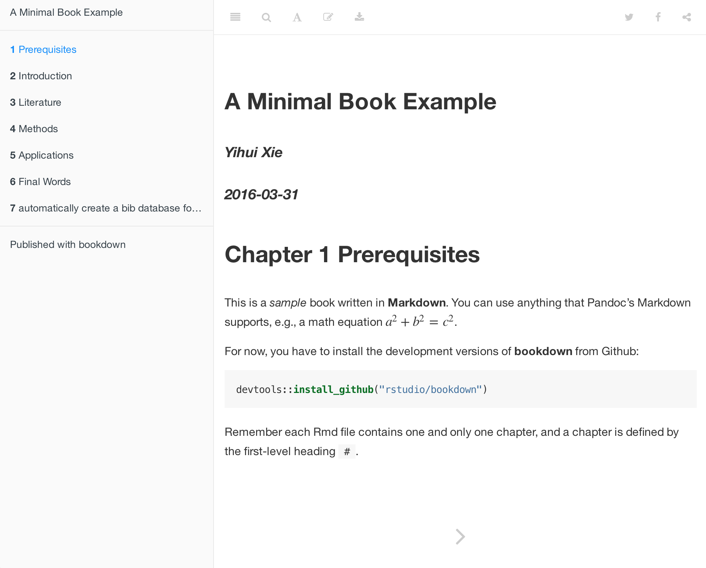

Getting Started
=================================

## Install {.bigNumber .color1}

First install the R package **bookdown** as follows:

```{r eval=FALSE}
install.packages('devtools')
devtools::install_github('rstudio/bookdown')
```

Note that it's important to install **devtools** first to ensure you are running a recent version of it (>= 1.10).

Next, install the latest [Preview Release](https://www.rstudio.com/products/rstudio/download/preview/) of RStudio IDE (>= v0.99.1121).


## Edit {.bigNumber .color2}

The best way to get started is to fork or clone the the repository <https://github.com/rstudio/bookdown-demo> (if you aren't familiar with Git and GitHub you can alternatively you can download it as a [zip file](https://github.com/rstudio/bookdown-demo/archive/master.zip)).

After you have the demo book, you should open it as a project within RStudio and build it via **Build Book** button:


By default the HTML, PDF, and ePub formats of the book will be compiled into the `_book` sub-directory of the project (you can also build a single format at at time using the Build Book menu).

Next, open the R Markdown file `index.Rmd` and click the button `Knit` on the toolbar of RStudio:


Now you should see the index page of this book demo in the RStudio Viewer (or the preview window). 



You may add or change the R Markdown files, come back to `index.Rmd`, and hit the `Knit` button again to preview the book. If you prefer not to use RStudio, you may also compile the book through command line. 

For the comprehensive documentation of **bookdown**, please see <https://bookdown.org/yihui/bookdown>.

## Publish {.bigNumber .color2}

To publish your books to bookdown.org, you need to first create an account by [signing in](/connect/) with your Google account, and then call the function `publish_book()` in R:

```{r eval=FALSE}
bookdown::publish_book(render = 'local')
```

If it is the first time you have tried to publish the book, you will be asked to authorize **bookdown** to publish to your bookdown.org account.


