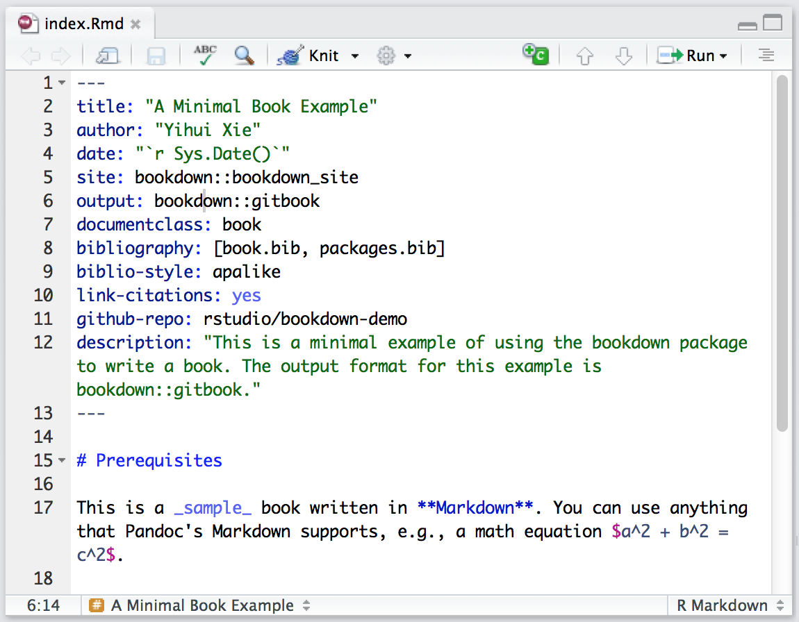
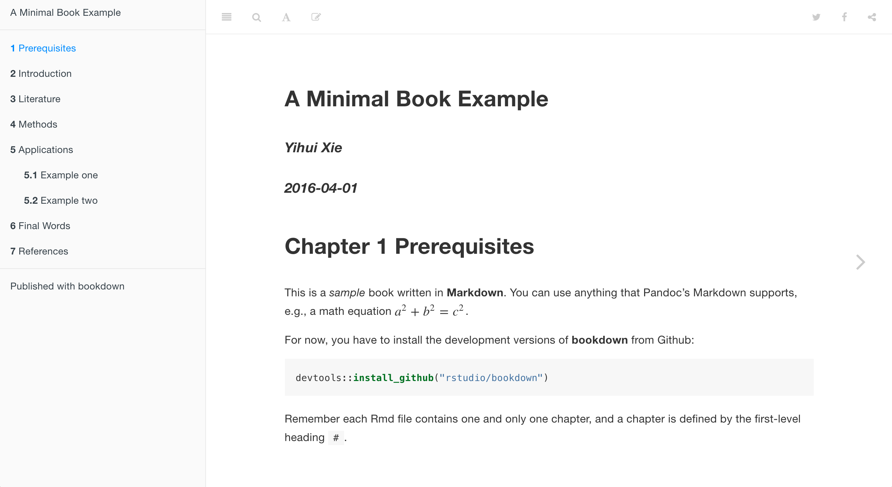
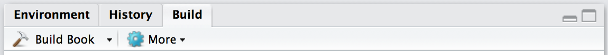

Getting Started
=================================

## Install {.bigNumber .color1}

First install the **bookdown** R package as follows:

```{r eval=FALSE}
install.packages('devtools')
devtools::install_github('rstudio/bookdown')
```

It is important to install **devtools** first since bookdown's installation requires its very latest version (v1.10).

Next, install the latest [Preview Release](https://www.rstudio.com/products/rstudio/download/preview/) of RStudio IDE (this release is required for the build and preview features described below).


## Edit {.bigNumber .color2}

The best way to get started is to fork or clone the the repository <https://github.com/rstudio/bookdown-demo> (if you are not familiar with Git and GitHub, you can alternatively download it as a [zip file](https://github.com/rstudio/bookdown-demo/archive/master.zip) and unzip it).

Open the demo book as a project within RStudio, open the `index.Rmd` file, and click the **Knit** button:




Now you should see the index page of this book demo in the preview window:



The **Knit** button renders just the chapter you are currently editing (e.g. `index.Rmd`, `01-intro.Rmd`, etc.) using the default output format for the book. To build all chapters and all formats of the book you can use the **Build Book** button within the RStudio Build pane:



By default the HTML, PDF, and ePub formats of the book will be compiled into the `_book` sub-directory of the project (you can also build a single format at a time using the **Build Book** menu).

For the comprehensive documentation of **bookdown**, please see <https://bookdown.org/yihui/bookdown>.

## Publish {.bigNumber .color2}

To publish your books to bookdown.org, you need to first create an account by [signing in](/connect/) with your Google account, and then call the function `publish_book()` in R:

```{r eval=FALSE}
bookdown::publish_book(render = 'local')
```

If it is the first time you have tried to publish the book, you will be asked to authorize **bookdown** to publish to your bookdown.org account.
