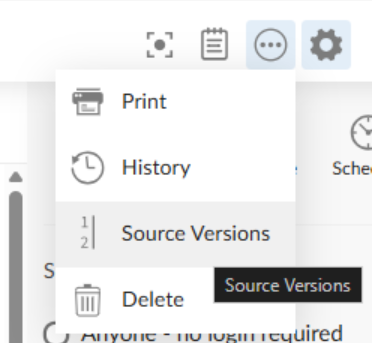
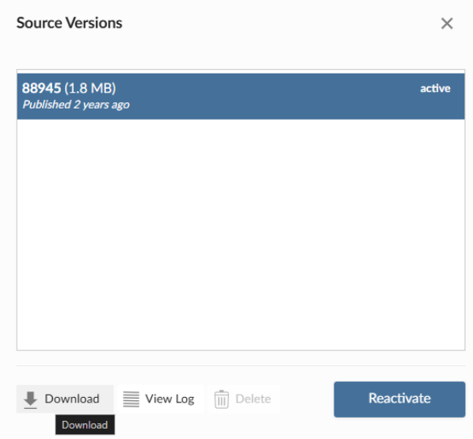
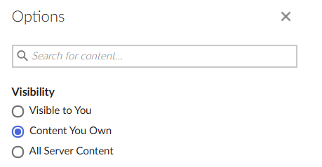
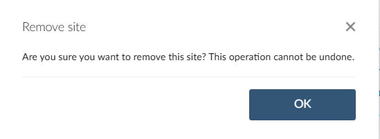

This guide provides step-by-step instructions for migrating your bookdown project from the retiring `bookdown.org` hosting service to [Posit Connect Cloud](https://connect.posit.cloud "Posit Connect Cloud"). Posit Connect Cloud is the recommended alternative for hosting your bookdown content, offering robust deployment, sharing, and management features.

## Prerequisites

Before starting the migration, ensure you have the following:

1.  **A Posit Connect Cloud Account:** Sign up or log in to your Posit Connect Cloud account.

2.  **R and RStudio (or Positron):** Make sure you have the latest versions of R and RStudio installed.

3.  **Required R Packages:** Ensure the bookdown and rsconnect packages are installed and up to date in your R environment. You need version bookdown 0.46 or later and rsconnect version 1.6.0 or later, both of them available from CRAN.

    ``` r
    # Install/update necessary packages
    install.packages(c("bookdown", "rsconnect"))
    # using pak
    pak::pak(c("bookdown", "rsconnect"))
    ```

4.  **Local bookdown Project:** You must have the source files for your bookdown project on your local machine. If you don’t have the source, you don’t need this guide. See the FAQ.

This is optional, though you can also navigate Connect Cloud documentation before starting your migration to know better about this hosting service: <https://docs.posit.co/connect-cloud/>

## TL;DR: Run `bookdown::publish_book()`

In **bookdown** 0.46, we updated `publish_book()` to prompt you to connect to Connect Cloud and deploy your book version, just as it was the case when deploying on [bookdown.org](http://bookdown.org)

To switch to publishing to Connect Cloud, the only thing you have to do is

``` r
bookdown::publish_book()
```

This will

1.  Remove [bookdown.org](http://bookdown.org) from know rsconnect server list (i.e. \`rsconnect::servers()\`) and from your accounts (i.e. `rsconnect::accounts()`)
2.  Prompt you to connect to <https://connect.posit.cloud> (i.e. call `rsconnect::connectCloudUser()` for you)
3.  Deploy your bookdown book (using `rsconnect::deploySite()`)

As with [bookdown.org](http://bookdown.org), only the static version of your book will be deployed, meaning the bookdown book needs to be rendered locally first, and be present in your bookdown output directory (e.g. default `_book` directory). If you have not already rendered the book, add `render = 'local'` to the command:

``` r
bookdown::publish_book(render = 'local')
```

Now go to your Connect Cloud account to see your book online!

## Detailed Steps to Publish Your Bookdown Book

### 1. Prepare Your Project for Connect Deployment {#prepare-project}

If you were publishing to [bookdown.org](http://bookdown.org), you probably added some specific YAML field in your index.Rmd like

``` yaml
description: "This is a minimal bookdown demo. It shows the basics of ..."
github-repo: "rstudio/bookdown-demo"
cover-image: "images/cover.png"
```

Those fields were used for listing on [bookdown.org](http://bookdown.org) and can now be removed as they are no longer needed for Connect Cloud publishing, as there will be no listing.

They won’t prevent or impact deployment if they are still there.

All other configurations for bookdown should stay.

### 2. Configure rsconnect for Posit Connect Cloud

The rsconnect package manages the connection and deployment process. To add connection to <https:://connect.posit.cloud> use:

``` r
rsconnect::connectCloudUser()
```

This needs to be run interactively as it will open a browser and prompt you to confirm a code. See `rsconnect::connectCloudUser()` doc for more information.

*Note: The bookdown package (version 0.46 or later) is updated so that running `bookdown::publish_book()` will prompt you to connect to Posit Connect Cloud if you don't have any existing Connect accounts configured.*

*Note: See official documentation on using the **rsconnect** package in <https://docs.posit.co/connect-cloud/user/publish/ide.html#rsconnect-package>*

### 3. Deploy Your Book

You can deploy your book using `bookdown::publish_book()`

1.  **Navigate to Project Directory:** Ensure your R session's working directory is the root of your bookdown project.
2.  **Run Deployment Command:** Use the bookdown::publish_book() function.

``` r
# Renders the book locally before deployment (recommended)
bookdown::publish_book(render = "local")
# Set a custom name at publishing (Defaults is `book_filename` in `_bookdown.yml` if not specified.)
bookdown::publish_book(name = 'name of the book', render = "local")
```

If you have only one account configured, rsconnect will deploy using that account. If you have multiple, you may be prompted to choose.

### 4. Manage Your Published Book on Connect Cloud

Once deployed, your book will be accessible on Posit Connect Cloud.

1.  **Access the Content:** A link to your newly published book will appear in the console or your browser.
2.  **Settings and Sharing:**
    -   Log in to Posit Connect Cloud and navigate to your book's landing page.
    -   You can manage access settings based on your [plan](https://connect.posit.cloud/plans). (e.g., public, private, specific groups).
    -   You can set a custom URL (also known as a vanity URL) for your book within the Connect Cloud domain.

See Connect Cloud User Guide for more information: <https://docs.posit.co/connect-cloud/user/>

## FAQ

### Q: Why is bookdown.org shutting down?

See the [bookdown.org sunset announcement post](https://posit.co/blog/bookdown-org-sunset).

### Q: What is the recommended alternative for hosting my book?

The recommended alternative, especially for users who want a simple deployment experience and enterprise-grade hosting, is **Posit Connect Cloud**. Alternatives also include hosting on services like GitHub Pages or Netlify.

### Q: Will my book's URL automatically redirect from bookdown.org?

No. Users are responsible for migrating their own content. However, Posit will offer a redirecting service upon request for a period of one year. Active bookdown.org users will receive an email with information on how to request a redirect for your book. You will need to have already migrated your book to an alternative hosting service, so that you can supply the new hosting location (e.g., your Connect Cloud URL).

### Q: Do I need to make any code changes to my Rmd files?

Generally, no. The deployment process via bookdown::publish_book() is compatible with existing bookdown projects. As there is no listing service anymore as with [bookdown.org](http://bookdown.org), you can even remove specific YAML fields that were used for [bookdown.org](http://bookdown.org) listing. See [1. Prepare Your Project for Connect Deployment](#prepare-project)

### Q: What happens to my book on bookdown.org after the sunset date?

The bookdown.org site will become read-only on **January 15, 2026**, and will transition to a static archive on **January 31, 2026**. Content will be accessible in an archived, read-only state until **January 31, 2027**, after which the site will be fully decommissioned. You must migrate your book before this date to ensure continuous availability.

### Q: Do I need to use `bookdown::publish_book()`?

No, you don’t. This function is provided for convenience for bookdown users. You can use **rsconnect** package directly, or follow one of the other publishing methods offered by Connect Cloud, like [deployment from GitHub](https://docs.posit.co/connect-cloud/user/publish/github.html) or [deployment from your IDE](https://docs.posit.co/connect-cloud/user/publish/ide.html)

### Q: Is Connect Cloud free like bookdown.org was?

Yes. Connect Cloud has a free tier that includes an unlimited number of published documents. However, it also offers paid plans with functionality that [bookdown.org](http://bookdown.org) did not offer. See <https://connect.posit.cloud/plans> for more details.

### Q: Are books on Connect Cloud publicly available?

Yes, any content on Connect Cloud is publicly available on the Free Plan. This is similar to [bookdown.org](http://bookdown.org) public hosting service.\
To disable public sharing and hide your book, or enable private sharing to share privately, an upgraded plan is required. See [docs.posit.co/connect-cloud/user/share](http://docs.posit.co/connect-cloud/user/share)

### Q: Can I get a vanity url like with bookdown.org?

Yes, it is possible to customize the url of your content by setting a custom name in the settings page of the content. Url would then be of the form `https://[account-name]-[custom-name].share.connect.posit.cloud`. See [Connect Cloud documentation on settings](https://docs.posit.co/connect-cloud/user/manage/content_settings.html#url)

### Q: Can I have my book rendered on Connect Cloud?

Yes, your bookdown project can be rendered directly on Connect Cloud. For that, you will need to add a manifest.json file so that Connect Cloud can restore your R environment. For a bookdown book, use `contentCategory = ‘site’`

``` r
rsconnect::writeManifest(contentCategory = "site")
```

See more details in the respective documentation:

-   `rsconnect::writeManifest()`: <https://rstudio.github.io/rsconnect/reference/writeManifest.html>

-   Connect Cloud R guide: <https://docs.posit.co/connect-cloud/how-to/r/dependencies.html>

With this file, you will be able to use `render = “server”`

``` r
bookdown::publish_book(render = 'server')
```

Your book will now be rendered directly on the Connect Cloud server.

If you need a specific configuration for rendering your document, see Connect Cloud documentation. For example, for environment variable: <https://docs.posit.co/connect-cloud/user/publish/github.html#advanced-settings>

### Q: Can I publish my bookdown project to Connect Cloud from GitHub, like with GitHub Actions?

Yes, you can, with some adaptation to your current workflow if you were using `publish_book()`. A current limitation is that to authenticate to Connect Cloud, the workflow requires an interactive setup for the authentication flow (i.e., `rsconnect::connectCloudUser()` can only be run interactively). Connect Cloud provides a GitHub App that allows you to directly connect your repository and allows automatic publishing on push, or manual refresh for Connect Cloud Dashboard. See <https://docs.posit.co/connect-cloud/user/publish/github.html>

This offers several options, depending on your desired workflow:

-   Option 1: Connect Cloud deployment from GitHub (recommended)

    You’ll need to set up your GitHub repository. Then your book could be published directly from source on every push to the repository. In that case, no need for GitHub actions. Less to maintain!

-   Option 2: You want more control and render the book on CI on every push, but decide when to publish.

    As Connect Cloud's automatic deployment can be configured with any branch, you could have a CI workflow that renders the book without publishing (e.g., for testing) and then commits the rendered output to another branch, configured for static site deployment on Connect Cloud.

### Q: I don’t want to migrate, but I want to download my current book hosted on bookdown.org. Can I do that?

bookdown.org is based on a Connect server, and if you have published content to it, you can access your dashboard to view and download your content.

This needs to be done before January 31, 2026, following these steps:

1.  Go to <https://bookdown.org/connect/> and click login (you may be redirected back to [bookdown.org](http://bookdown.org) - if so, follow step two)

2.  Once logged in, go to <https://bookdown.org/connect/>

3.  Select your content, and click “source versions”

    

4.  Then select the source you want to download and click download

    {width="510"}

If you prefer, you can do that programmatically, using the **connectapi** package. See `connectapi::download_bundle()`.

This method of downloading books will no longer be available after January 31, 2026.

### Q: I don’t have my bookdown project sources, but I have the rendered HTML. Can I publish it?

Yes. `bookdown::render_book()` has produced for you at the time a static website, and it can be hosted anywhere that supports such content.\
\
Connect Cloud can host static content. You can use the Connect Cloud website to configure or use the **rsconnect** package to deploy it. `bookdown::publish_book()` won’t be adapted.

You could also consider Netlify, GitHub Pages, or any other static page hosting service.

### Q: I don’t want my content being in the read-only version of [bookdown.org](http://bookdown.org) for 2026. How to delete my content currently published on [bookdown.org](http://bookdown.org) ?

To remove your content, you can follow these steps:

1.  Go to <https://bookdown.org/connect/> and click login (you may be redirected back to [bookdown.org](http://bookdown.org) - if so, follow step two)

2.  Once logged in, go to <https://bookdown.org/connect/> 

3.  Select your content

    

4.  On the content settings page, click delete on the settings

    

5.  Validate

    

### Q: I still need to update my content on [bookdown.org](http://bookdown.org). Can I do that?

Yes, you can still update your content until January 31, 2026. However, as mentioned in this migration guide, in version 0.46 of bookdown, `bookdown::publish_book()` won’t allow to publish to [bookdown.org](http://bookdown.org) anymore. 

So if you need to update your content, the easiest is to not update **bookdown** yet. Use version 0.45 or below. \
If you need to install 0.45, you can use the packagemanager frozen repo using the following command:

``` r
install.packages("bookdown", repos = "https://packagemanager.posit.co/cran/2025-12-02")
```

Another option is to use **rsconnect** package:

``` r
# If you got bookdown.org server removed 
rsconnect::addServer("https://bookdown.org/__api__", "bookdown.org")
rsconnect::connectUser(server = "bookdown.org")

# deploy your book
rsconnect::deploySite(siteDir = getwd(),server ="bookdown.org")
```

This method of updating books will no longer be available after January 31, 2026.
